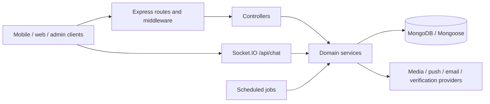

# Architecture

## Runtime and Boundaries

Lumore is a Node.js ES-module backend using Express 5, Mongoose, Socket.IO, and node-cron. HTTP, realtime connections, and scheduled jobs share one server process. MongoDB stores application state; connected sockets are tracked in process memory.

## Module Organization

| Directory | Responsibility |
| --- | --- |
| `routes/` | Endpoint registration and middleware ordering |
| `controllers/` | Request validation, orchestration, HTTP responses |
| `services/` | Matching, credits, messaging cleanup, notifications, integrations |
| `models/` | Schemas, references, indexes, persistence constraints |
| `middleware/` | Authentication, admin access, uploads, validation, rate limits, errors |
| `config/`, `utils/`, `libs/` | Infrastructure configuration, helpers, shared constants |

Routes delegate request handling to controllers; business logic and provider calls belong in services. Keep route modules focused on endpoint registration and middleware ordering.

## Startup and Request Pipeline

[server.js](../../server.js) loads environment variables, awaits the MongoDB connection, creates the HTTP server, and initializes sockets and cron jobs. [app.js](../../app.js) configures Express middleware and mounts feature routers, so it can be imported without starting background jobs or opening a server listener.

HTTP middleware applies Helmet and CORS. Webhook routes mount before the global JSON parser so HaloKYC can consume raw JSON bytes. Feature routers follow body parsing; not-found and error handlers run last. The server binds `0.0.0.0`, using `PORT` or `5000`.

## Integrations and Consistency

External integrations include Google and Telegram authentication, HaloKYC verification, Cloudinary media handling, SMTP email, OneSignal, and Web Push. Configuration varies by feature; see [development.md](development.md).

[utils/transaction.js](../../utils/transaction.js) manages MongoDB sessions and supports caller-provided fallbacks when transactions are unsupported. Fallback behavior is feature-specific; multi-document operations are not universally atomic. The socket service uses an in-memory user/socket map; review connection routing and cross-process event delivery before scaling to multiple instances.
